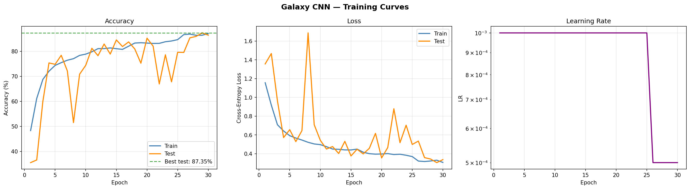
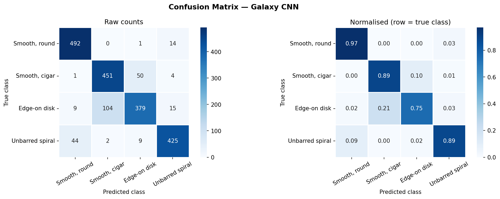

# 🌌 Galaxy Morphology Classifier

A Convolutional Neural Network (CNN) trained from scratch to classify galaxy images into 4 morphological types using the **Galaxy-MNIST** dataset.

**Final test accuracy: ~88%** — trained in 30 epochs on an RTX 4050.

---

## Galaxy classes

| Label | Type | Description |
|---|---|---|
| 0 | Smooth, round | Elliptical galaxies with no visible structure |
| 1 | Smooth, cigar | Elongated ellipticals |
| 2 | Edge-on disk | Disk galaxies seen from the side |
| 3 | Unbarred spiral | Face-on spiral galaxies |

---

## Results

| Metric | Value |
|---|---|
| Overall test accuracy | ~88% |
| Smooth, round | ~93% |
| Smooth, cigar | ~85% |
| Edge-on disk | ~85% |
| Unbarred spiral | ~89% |


Training curves and confusion matrix:




---

## Setup

### 1. Clone the repository
```bash
git clone https://github.com/YOUR_USERNAME/galaxy-morphology-classifier.git
cd galaxy-morphology-classifier
```

### 2. Create a virtual environment (recommended)
```bash
python -m venv venv
source venv/bin/activate        # Linux / macOS
venv\Scripts\activate           # Windows
```

### 3. Install dependencies
```bash
pip install torch torchvision
pip install galaxy-datasets
pip install scikit-learn matplotlib seaborn pandas numpy
```

> **Note:** For GPU support, install the CUDA version of PyTorch from [pytorch.org](https://pytorch.org/get-started/locally/).

---

## Usage

Open the notebook and run all cells from top to bottom:

```bash
jupyter notebook galaxy_mnist_classifier.ipynb
```

The dataset (~300 MB) downloads automatically on the first run into `./data/`.  
No manual file management needed.

---

## Notebook structure

| Cell | Purpose |
|---|---|
| 1 | Install dependencies |
| 2 | Import libraries |
| 3 | Download Galaxy-MNIST dataset automatically |
| 4 | Preview sample images from each class |
| 5 | Build PyTorch Dataset with augmentation |
| 6 | Build DataLoaders with class balancing |
| 7 | Define CNN architecture |
| 8 | Set up loss, optimizer, and LR scheduler |
| 9 | Training loop (30 epochs) |
| 10 | Plot training curves |
| 11 | Evaluate on test set |
| 12 | Confusion matrix |
| 13 | Save model weights |

---

## Architecture

```
Input (3, 224, 224)
  → Conv Block 1: 3  → 32  channels  + BN + ReLU + MaxPool  → (32, 112, 112)
  → Conv Block 2: 32 → 64  channels  + BN + ReLU + MaxPool  → (64,  56,  56)
  → Conv Block 3: 64 → 128 channels  + BN + ReLU + MaxPool  → (128, 28,  28)
  → Conv Block 4: 128→ 256 channels  + BN + ReLU + MaxPool  → (256, 14,  14)
  → Conv Block 5: 256→ 256 channels  + BN + ReLU + MaxPool  → (256,  7,   7)
  → Global Average Pool                                      → (256)
  → FC(256→512) + ReLU + Dropout(0.5)
  → FC(512→128) + ReLU + Dropout(0.25)
  → FC(128→4)                                               → 4 class scores
```

**Key design choices:**
- `BatchNorm` after every conv — stabilises training and allows a higher learning rate
- `GlobalAvgPool` instead of raw flatten — fewer parameters, less overfitting
- `Dropout` in the classifier — prevents the model from memorising training images
- `WeightedRandomSampler` — over-samples under-represented classes for balanced training

---

## Dataset

Galaxy-MNIST is a subset of the [Galaxy Zoo](https://www.zooniverse.org/projects/zookeeper/galaxy-zoo/) citizen science project, curated as an MNIST-style benchmark.

- 8,000 training images
- 2,000 test images
- 64×64 RGB galaxy images (resized to 224×224 for this project)

```python
from galaxy_datasets import galaxy_mnist

catalog, label_cols = galaxy_mnist(root='./data', download=True, train=True)
```

---

## File structure

```
galaxy-morphology-classifier/
├── galaxy_mnist_classifier.ipynb   # main notebook
├── training_curves.png             # accuracy, loss, LR plots
├── confusion_matrix.png            # per-class confusion heatmap
├── galaxy_cnn_best.pth             # saved model weights (generated after training)
├── README.md
└── data/                           # downloaded automatically by galaxy-datasets
```

---

## References

- Walmsley et al. (2022) — [Galaxy-MNIST dataset](https://github.com/mwalmsley/galaxy-datasets)
- Galaxy Zoo — [zooniverse.org](https://www.zooniverse.org/projects/zookeeper/galaxy-zoo/)

